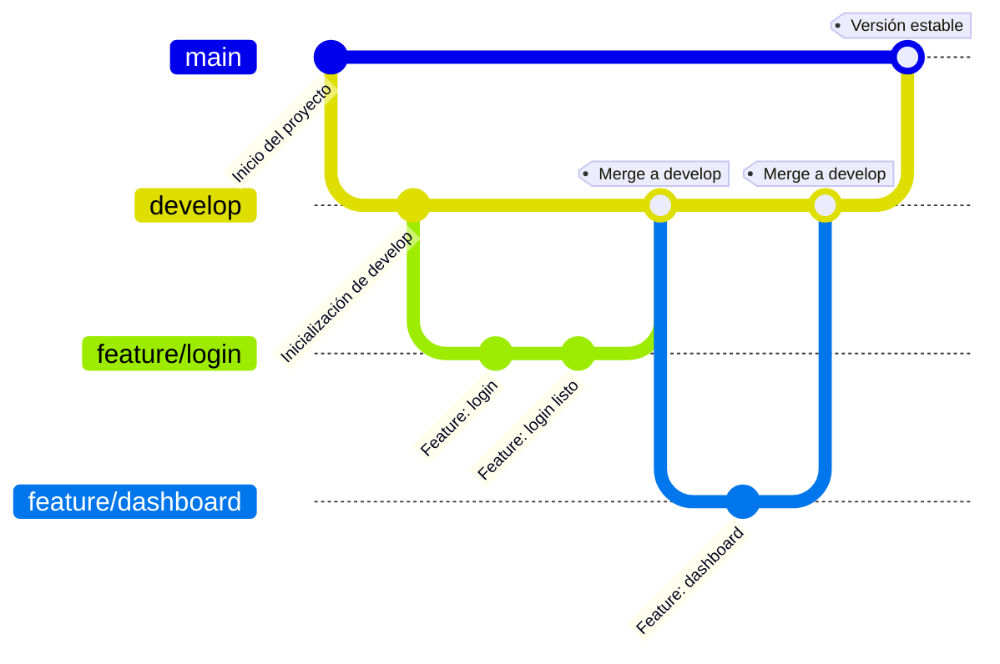

# 🛠️ DevOps para TransChile

Este proyecto tiene como objetivo modernizar y optimizar el proceso de desarrollo de software en TransChile, una empresa nacional de transporte de carga. A través de prácticas DevOps, se busca mejorar la eficiencia, seguridad y calidad de sus soluciones tecnológicas.

## 🧩 Problemas Detectados y Soluciones DevOps Propuestas

| 🛑 Problema | 💡 Solución |
|------------|------------|
| 🗃️ **Sin control de versiones** No se utiliza Git ni repositorios centralizados. La integración manual del código, realizada una vez al mes y subida por FTP, incrementa la posibilidad de errores y retrasa la entrega de nuevas funcionalidades. | 🔧 **Implementar control de versiones** Capacitar al equipo en comandos básicos de Git y uso de GitHub, gestión de ramas (`main`, `develop`, `feature/*`). |
| ❗ **Flujo de trabajo desorganizado** No se define un proceso para el desarrollo. Cada desarrollador trabaja de forma aislada y realiza cambios sin pasar por revisiones de código, lo que compromete la coherencia y calidad del producto final | 🔁 **Adoptar metodología Git Flow / Trunk-Based** Control estructurado del ciclo de vida del software. |
| 🔓 **Riesgos de seguridad** No se auditan dependencias ni se revisa el código. No existen procesos de análisis de código o auditorías de seguridad, lo que deja la puerta abierta a múltiples riesgos cibernéticos. | 🛡️ **Seguridad DevSecOps** Integrar escaneo con Trivy o Dependency-Check. |
| 📉 **Calidad de código deficiente** No hay análisis estático ni métricas. La falta de revisión formal del código contribuye a una alta tasa de errores en producción, que podrían evitarse con un control de calidad riguroso. | 📊 **Integrar SonarQube ** Evaluar bugs, code smells y deuda técnica. |
| 🚫 **Sin integración continua (CI)** Los despliegues son manuales y propensos a errores. La falta de pruebas automáticas antes de subir a producción pone en riesgo la estabilidad del sistema. | ⚙️ **CI con GitHub Actions** Automatizar pruebas, builds y despliegues. |

---
Propuesta de un  flujos de trabajo
---

🗂️ **Explicación del flujo:**- `main`: contiene únicamente código listo para producción.- `develop`: rama central de desarrollo, donde se integran nuevas funcionalidades.- `feature/*`: ramas creadas para trabajar en nuevas funcionalidades, que luego se integran a `develop`.Este modelo permite un desarrollo ordenado, colaborativo y controlado, facilitando la entrega continua.

## 🚀 Pipeline CI/CD (Ejemplo GitHub Actions)

Este proyecto cuenta con un pipeline de integración y entrega continua (CI/CD) configurado en GitHub Actions, que se ejecuta automáticamente en cada `push` o `pull request` hacia la rama `main`.

### ✅ Beneficios

- Detección temprana de errores y vulnerabilidades.
- Asegura calidad del código antes de llegar a producción.
- Automatización completa del proceso de validación y análisis.

### 🔄 ¿Qué hace este pipeline?

1. **🔄 Clona el repositorio**  
   Descarga el código fuente para su análisis y pruebas.

2. **⚙️ Configura el entorno Node.js**  
   Instala Node.js (versión 18) para ejecutar y testear el proyecto.

3. **📦 Instala dependencias**  
   Ejecuta `npm install` para preparar el entorno.

4. **🧪 Ejecuta pruebas automáticas**  
   Corre `npm test` para validar que el código funciona correctamente.

5. **🔍 Escanea seguridad con Trivy**  
   - Analiza el proyecto en busca de vulnerabilidades.  
   - Genera un reporte en formato JSON.

6. **📄 Integra resultados con SonarQube**  
   - Convierte el reporte de Trivy al formato compatible con SonarQube.  
   - Ejecuta el análisis de calidad del código, incorporando también los hallazgos de seguridad.

Consulta el archivo `.github/workflows/ci-cd.yml` para más detalles.

## 🧪 Análisis de Vulnerabilidades con SonarQube
Se utiliza **SonarQube** para realizar análisis estático del código, detectando vulnerabilidades, errores y malas prácticas antes de que lleguen a producción.

### 🛡️ Protección de la Infraestructura
- Escaneo continuo con herramientas como **Trivy**.
- Aplicación del principio de **menor privilegio** en accesos y credenciales.
- Separación de entornos (desarrollo, pruebas, producción).
- Automatización de parches y monitoreo de actividad sospechosa.

### 📦 Gestión de Dependencias Seguras
El uso de paquetes inseguros puede comprometer todo el sistema. Para prevenirlo:
- Se escanean dependencias con **OWASP Dependency-Check**.
- Se mantiene un inventario actualizado de librerías.
- Se priorizan paquetes con mantenimiento activo y buena reputación.
- Se configuran alertas ante nuevas vulnerabilidades (CVEs).

---

Este enfoque DevSecOps garantiza que la seguridad no sea un paso final, sino una práctica continua integrada en todo el proceso de desarrollo.

---
## 🧾 Conclusión

La implementación de DevOps en TransChile permitirá modernizar su área tecnológica, reduciendo errores, acelerando las entregas y fortaleciendo la seguridad del software. Esto permitirá abordar problemas clave como la ausencia de control de versiones, la falta de automatización y la escasa calidad del código.

Mediante flujos de trabajo estructurados, integración continua y herramientas de análisis de calidad y seguridad, TransChile podrá mejorar significativamente los tiempos de entrega, la confiabilidad del software y su capacidad de respuesta ante incidentes.

