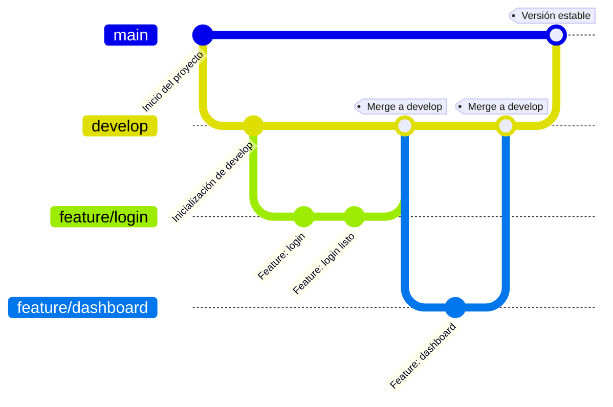

# 🛠️ DevOps para TransChile

Este proyecto tiene como objetivo modernizar y optimizar el proceso de desarrollo de software en TransChile, una empresa nacional de transporte de carga. A través de prácticas DevOps, se busca mejorar la eficiencia, seguridad y calidad de sus soluciones tecnológicas.

## 🧩 Problemas Detectados y Soluciones DevOps Propuestas

| 🛑 Problema | 💡 Solución |
|------------|------------|
| 🗃️ **Sin control de versiones** No se utiliza Git ni repositorios centralizados. La integración manual del código, realizada una vez al mes y subida por FTP, incrementa la posibilidad de errores y retrasa la entrega de nuevas funcionalidades. | 🔧 **Implementar control de versiones** Uso de Git con GitHub/GitLab, gestión de ramas (`main`, `develop`, `feature/*`). |
| ❗ **Flujo de trabajo desorganizado** No se define un proceso para el desarrollo. Cada desarrollador trabaja de forma aislada y realiza cambios sin pasar por revisiones de código, lo que compromete la coherencia y calidad del producto final | 🔁 **Adoptar metodología Git Flow / Trunk-Based** Control estructurado del ciclo de vida del software. |
| 🔓 **Riesgos de seguridad** No se auditan dependencias ni se revisa el código. No existen procesos de análisis de código o auditorías de seguridad, lo que deja la puerta abierta a múltiples riesgos cibernéticos. | 🛡️ **Seguridad DevSecOps** Integrar escaneo con Trivy o Dependency-Check. |
| 📉 **Calidad de código deficiente** No hay análisis estático ni métricas. La falta de revisión formal del código contribuye a una alta tasa de errores en producción, que podrían evitarse con un control de calidad riguroso. | 📊 **Integrar SonarQube ** Evaluar bugs, code smells y deuda técnica. |
| 🚫 **Sin integración continua (CI)** Los despliegues son manuales y propensos a errores. La falta de pruebas automáticas antes de subir a producción pone en riesgo la estabilidad del sistema. | ⚙️ **CI con GitHub Actions** Automatizar pruebas, builds y despliegues. |

---
title: Example Git diagram
---

🗂️ **Explicación del flujo:**- `main`: contiene únicamente código listo para producción.- `develop`: rama central de desarrollo, donde se integran nuevas funcionalidades.- `feature/*`: ramas creadas para trabajar en nuevas funcionalidades, que luego se integran a `develop`.Este modelo permite un desarrollo ordenado, colaborativo y controlado, facilitando la entrega continua.

## 🚀 Pipeline CI/CD (Ejemplo GitHub Actions)

El proyecto incluye una plantilla de CI/CD que:

- Ejecuta pruebas automáticas. 
- Analiza la calidad del código.
- Escanea vulnerabilidades

Consulta el archivo `.github/workflows/ci-cd.yml` para más detalles.

## 📈 Beneficios Esperados

- Reducción de errores en producción.
- Mayor velocidad en entregas.
- Mejor seguridad y trazabilidad.
- Flujo de trabajo colaborativo y ordenado.

---
